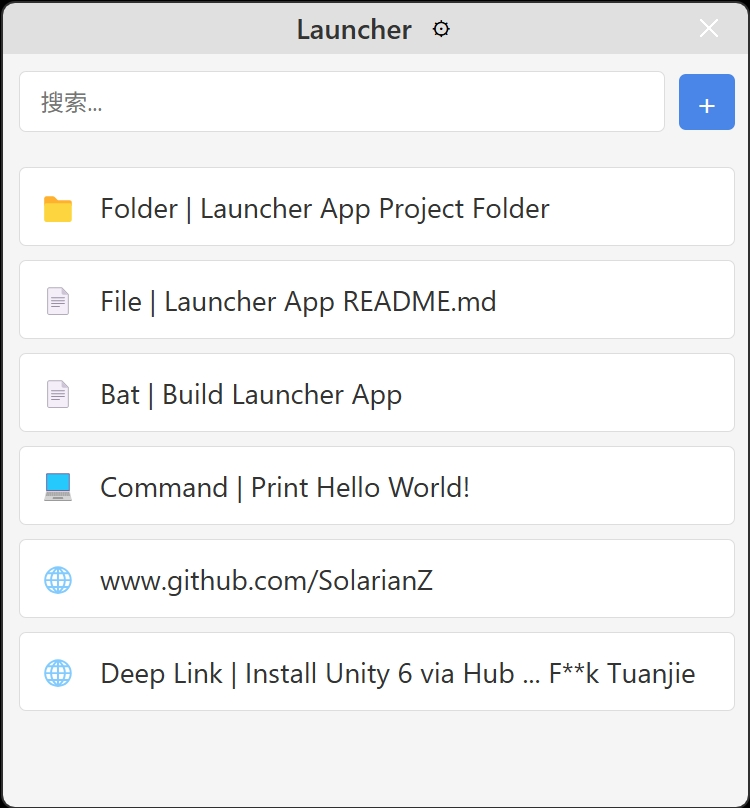

# Launcher App

> 🚀 快速访问常用文件、文件夹、URL 和命令的桌面启动器应用




## 📋 项目简介

Launcher App 是一款基于 Electron 开发的桌面快速启动器工具，帮助用户快速访问常用的文件、文件夹、网站和命令。

> ⚠️ **声明：** 
> 1. 本项目的代码主要由人工智能辅助生成。项目结构、功能实现及界面设计均使用了 AI 技术。
> 2. 此文档内容亦主要由 AI 生成。
> 3. 软件未经严格测试。

## ✨ 主要功能

- 🗂️ 添加和管理多种类型的条目
  - 文件
  - 文件夹
  - 网址和 Deep Link
  - 命令行指令
- 🔍 快速搜索条目
- 🖱️ 支持拖放文件/文件夹直接添加
- 📋 右键菜单提供丰富操作选项
- 🌓 支持深色和浅色主题
- 🌍 支持多语言
- ⌨️ 自定义全局快捷键呼出应用（默认是Alt+Shift+Q）
- 🧩 系统托盘集成，显示最近使用的条目
- 🔄 支持拖拽重新排序列表
- ⚡ 通过双击或回车快速打开项目
- 💬 跨平台支持 (Windows, macOS, Linux，未严格测试)

## 📥 构建

1. 确保已安装 [Node.js](https://nodejs.org/) (22 LTS 或更高版本)

2. 克隆仓库:

```bash
git clone https://github.com/SolarianZ/launcher-app-electron.git
cd launcher-app-electron
```

3. 安装依赖:

```bash
npm install
```

4. 启动应用:

```bash
npm start
```

### 📦 打包应用

使用 electron-builder 打包为可分发的应用程序:

```bash
npm run build
```

生成的安装包将保存在 `dist` 目录中。

## 🧩 技术实现

- **Electron**: 跨平台桌面应用框架
- **模块化架构**: 主进程和渲染进程分离
- **IPC通信**: 进程间安全通信
- **本地存储**: JSON文件持久化数据
- **国际化**: 多语言支持系统
- **响应式UI**: 适配不同尺寸和主题
